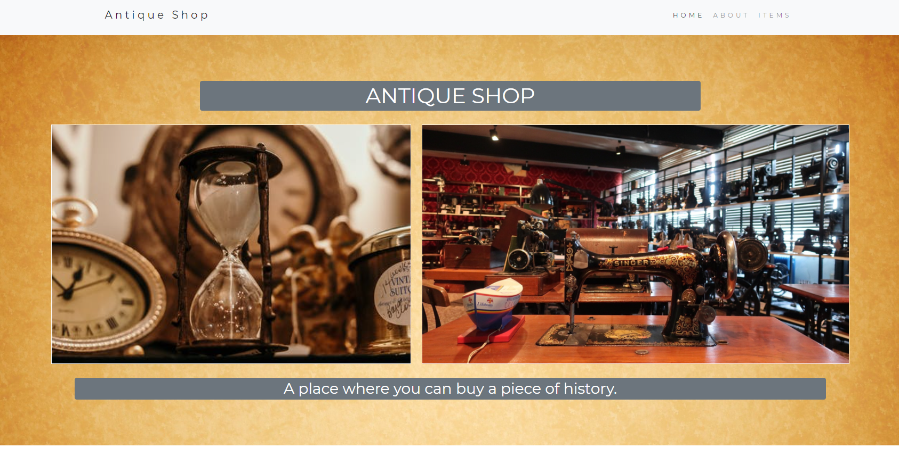
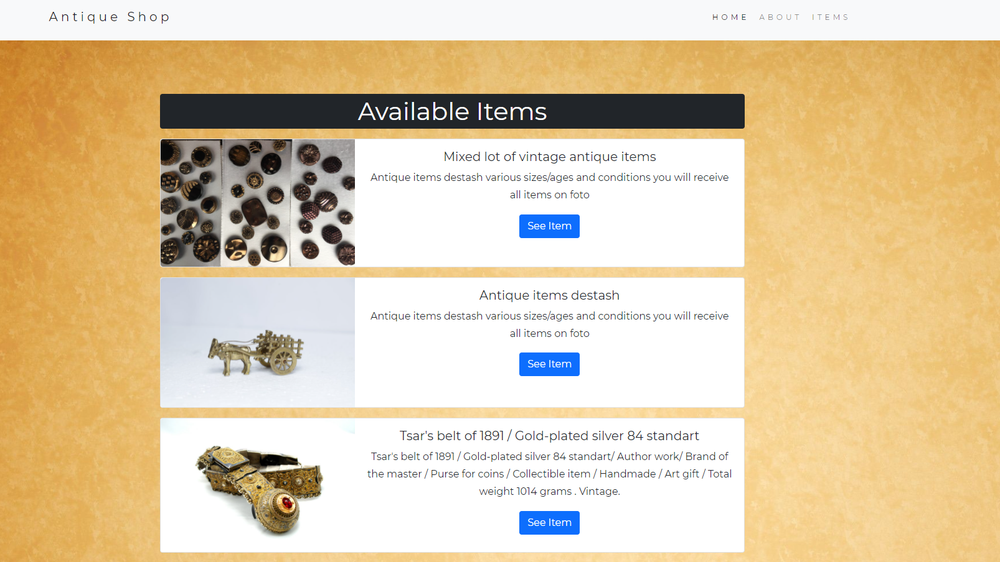
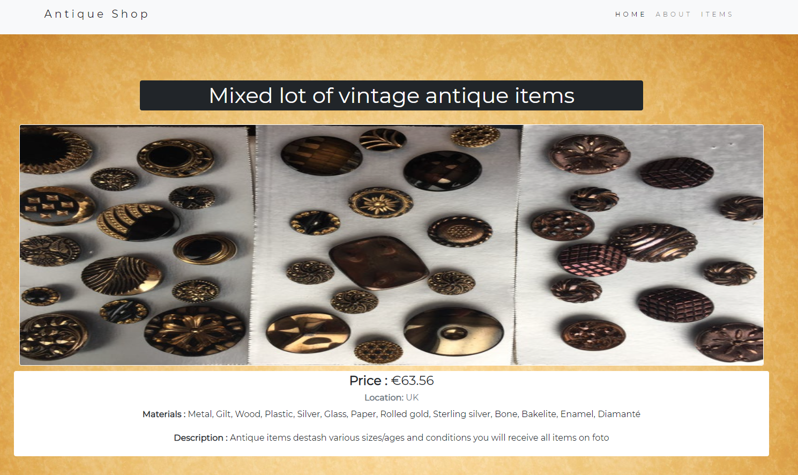

# Antique_zone_nodejs

This is a project made with Node js environment. The main aim of that project was to create a website that acquires all the files through server side rendering. In this project I have used html template to render all the data from server and send the files according to the request. Real database is not present in this project and all the data was rendered from a json file that is part of this project files. Different Node js modules like fs, http, url were used to complete this project.





</h1>Additional description about the project and its features.</h1>

<h2>Built With</h2>

- HTML
- Vanila javascript
- Node JS

<h2>Getting Started</h2>
To get a local copy up and running follow these simple example steps.

```
- first clone the repository
- use your terminal
- go to the project directory using cd (directory name)
- run "npm install" to install all the dependencies
- run "npx nodemon index.js"

```

<h2>Prerequisites for this project</h2>

```
- A good text editor (ex.Vscode)
- Github profile
- Git installed in your local machine
```

<h2>Limitations of the project</h2>

```
- No realtime database.
- No frameworks were used.
- Live link unavailable.

```

<h2>Authors</h2>

👤 Author1

Github: @ajkacca457

Twitter: @ajkacca

Linkedin: https://www.linkedin.com/in/avijit-karmaker-8738a54a/

<h2> 🤝 Contributing</h2>

Contributions, issues and feature requests are welcome!

Feel free to check the issues page.

Show your support
Give a ⭐️ if you like this project!

 <h2> 📝 License</h2>
This project is a personal project of Avijit.
